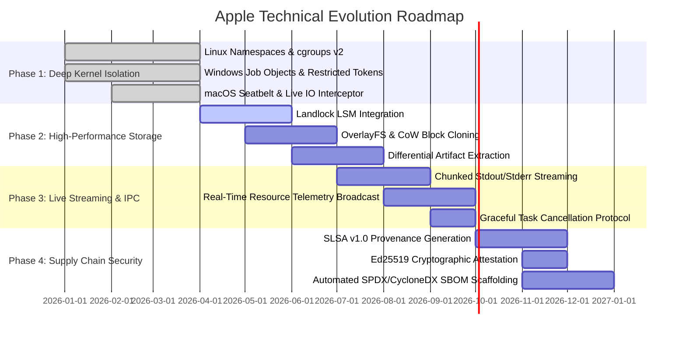

# 🗺️ Apple Roadmap: Hermetic Sandbox & Isolation Architecture

> 🌐 **Language Navigation / 多语言文档 / 多語言文檔 / ドキュメント言語:**
> [English](ROADMAP.md) | [Tiếng Việt](docs/vi/ROADMAP.md) | [日本語](docs/ja/ROADMAP.md) | [简体中文](docs/zh-hans/ROADMAP.md) | [繁體中文](docs/zh-hant/ROADMAP.md)

---

## 📌 Vision & Architecture Strategy

**Apple** is the enterprise-grade hermetic sandbox, process isolation daemon, and deterministic execution engine designed for multi-toolchain build systems (paired with [Fish](https://github.com/requla11/fish)).

This roadmap outlines the technical phases, architectural milestones, and delivery timelines to evolve Apple from a fast local jail into a battle-tested, kernel-level containment engine with SLSA Build Level 3 supply chain attestations.

---

## 🛣️ Roadmap Overview

---

## 🎯 Phase Details

### Phase 1: Deep OS Kernel Isolation & Process Containment (Completed)
- [x] **Linux Kernel Namespaces**: Unprivileged container isolation (`CLONE_NEWNS`, `CLONE_NEWNET`, `CLONE_NEWPID`, `CLONE_NEWIPC`, `CLONE_NEWUTS`, `CLONE_NEWUSER`).
- [x] **cgroups v2 Resource Accounting**: Strict hardware resource quotas for RAM (`memory.max`), CPU quota (`cpu.max`), and CPU core affinity (`cpuset.cpus`).
- [x] **seccomp-bpf Syscall Filtering**: System call policy blocking unauthorized calls (`ptrace`, raw socket bindings when offline, kernel module operations).
- [x] **Windows Job Objects & Restricted Tokens**: Peak RAM consumption measurement via `QueryInformationJobObject`, administrator SID stripping, and Low Integrity Level (`SECURITY_MANDATORY_LOW_RID`).
- [x] **macOS Darwin Seatbelt Isolation**: Sandbox Profile Language (SBPL) generator and `sandbox-exec` wrapper for `clang`, `swiftc`, and `rustc`.
- [x] **Live I/O & Secret Probe Interceptor**: Real-time inspection catching unauthorized access to `.env`, `id_rsa`, AWS credentials, and undeclared DAG headers.

---

### Phase 2: Ultra-Fast Storage Jails & Zero-Copy Snapshots (Q2-Q3 2026)
- [ ] **Linux Landlock LSM Integration**:
  - Unprivileged filesystem access restriction at the Linux kernel level (Kernel 5.13+).
  - Explicit read/write directory access grants without requiring root privileges.
- [ ] **Copy-on-Write (CoW) & Instant Block Cloning**:
  - Integrate OverlayFS (Linux), APFS `clonefile` (macOS), and ReFS Block Cloning (Windows).
  - Reduce jail creation latency from ~50ms to **< 1ms** across repositories with 100k+ source files.
- [ ] **Differential Artifact Sync**:
  - Automatically identify newly produced build artifacts (`target/`, `.o`, `dist/`) and sync only valid outputs back to the workspace.
  - Automatically discard intermediate compiler noise, keeping workspace directories clean.

---

### Phase 3: Real-Time Streaming IPC & Telemetry Broadcast (Q3 2026)
- [ ] **Chunked Output Streaming**:
  - Stream stdout and stderr chunks in real-time over Unix Domain Sockets and Windows Named Pipes.
  - Eliminate IPC buffer bloat on long-running compilation tasks.
- [ ] **Live Telemetry & Dashboard Integration**:
  - Broadcast real-time CPU percentages, peak RSS, and I/O rate metrics directly to Fish Web Dashboard and Ratatui TUI.
- [ ] **Instant Cancellation Protocol**:
  - Support `DaemonMessage::Cancel { task_id }` with immediate process group termination (`SIGKILL`) and Windows Job Object closure.

---

### Phase 4: Enterprise Supply Chain Security & SLSA v1.0 (Q4 2026)
- [ ] **SLSA Build Level 3 Provenance**:
  - Generate verifiable, tamper-evident in-toto / SLSA v1.0 provenance metadata JSON.
  - Document all input hashes, compiler flags, hermetic environment snapshots, and artifact BLAKE3 hashes.
- [ ] **Cryptographic Signing (Ed25519 & Cosign)**:
  - Cryptographically sign verification reports and build attestations using hardware tokens or local Ed25519 keypairs.
- [ ] **Automated SBOM Generation**:
  - Output standardized SPDX and CycloneDX Software Bill of Materials linked with the build audit trail.

---

### Phase 5: Distributed Sandboxing & Micro-VM Containment (2027+)
- [ ] **Micro-VM Fallback Engine**:
  - Optional Firecracker / Cloud-Hypervisor micro-VM runner for executing untrusted build scripts and 3rd-party compiler plugins.
- [ ] **Distributed Remote Worker Sandboxing**:
  - Native gRPC execution protocol to synchronize hermetic environments across remote build farms.

---

## 📈 Quality & Verification Invariants

1. **Zero Fake Stubs**: Every capability must provide real OS isolation or fail with typed errors.
2. **Zero Code Comments**: Maintain clean, self-documenting code across all crates.
3. **Cross-Platform Compatibility**: Parity across Linux, Windows, and macOS.
4. **100% CI Gate**: Every pull request must pass all matrix tests across all operating systems.
