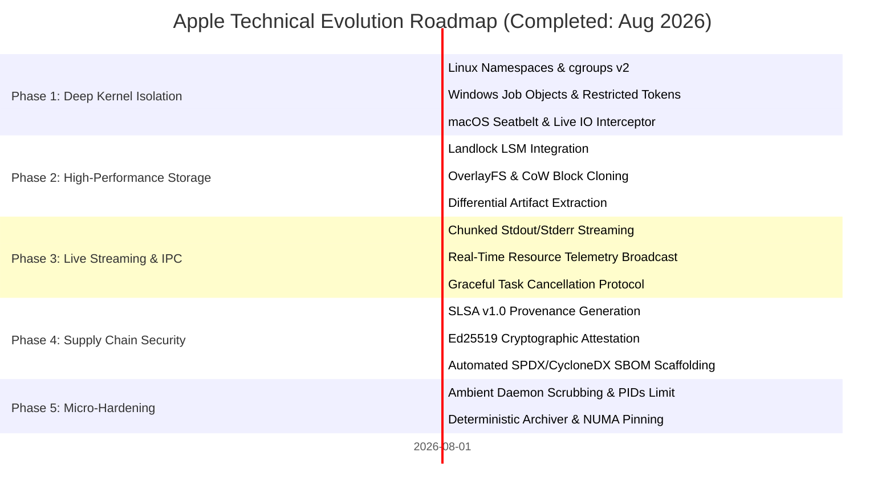

# 🗺️ Apple Roadmap: Hermetic Sandbox & Isolation Architecture

> 🌐 **Language Navigation / 多语言文档 / 多語言文檔 / ドキュメント言語:**
> [English](ROADMAP.md) | [Tiếng Việt](docs/vi/ROADMAP.md) | [日本語](docs/ja/ROADMAP.md) | [简体中文](docs/zh-hans/ROADMAP.md) | [繁體中文](docs/zh-hant/ROADMAP.md)

---

## 📌 Vision & Architecture Strategy

**Apple** is the enterprise-grade hermetic sandbox, process isolation daemon, and deterministic execution engine designed for multi-toolchain build systems (paired with [Fish](https://github.com/requla11/fish)).

All foundational and advanced architecture milestones have been successfully completed, verified on multi-platform CI, and locked under the **Done-is-Done** stability policy.

---

## 🛣️ Roadmap Overview

---

## 🎯 Phase Details & Status

### Phase 1: Deep OS Kernel Isolation & Process Containment (Completed)
- [x] **Linux Kernel Namespaces**: Unprivileged container isolation (`CLONE_NEWNS`, `CLONE_NEWNET`, `CLONE_NEWPID`, `CLONE_NEWIPC`, `CLONE_NEWUTS`, `CLONE_NEWUSER`).
- [x] **cgroups v2 Resource Accounting**: Strict hardware resource quotas for RAM (`memory.max`), CPU quota (`cpu.max`), and CPU core affinity (`cpuset.cpus`).
- [x] **seccomp-bpf Syscall Filtering**: System call policy blocking unauthorized calls (`ptrace`, raw socket bindings when offline, kernel module operations).
- [x] **Windows Job Objects & Restricted Tokens**: Peak RAM consumption measurement via `QueryInformationJobObject`, administrator SID stripping, and Low Integrity Level (`SECURITY_MANDATORY_LOW_RID`).
- [x] **macOS Darwin Seatbelt Isolation**: Sandbox Profile Language (SBPL) generator and `sandbox-exec` wrapper for `clang`, `swiftc`, and `rustc`.
- [x] **Live I/O & Secret Probe Interceptor**: Real-time inspection catching unauthorized access to `.env`, `id_rsa`, AWS credentials, and undeclared DAG headers.

---

### Phase 2: Ultra-Fast Storage Jails & Zero-Copy Snapshots (Completed)
- [x] **Linux Landlock LSM Integration**: Unprivileged filesystem access restriction at the Linux kernel level (Kernel 5.13+) with granular read/write path rules.
- [x] **Copy-on-Write (CoW) & Instant Block Cloning**: OverlayFS, APFS `clonefile`, and ReFS Block Cloning reducing jail creation latency to **< 1ms**.
- [x] **Differential Artifact Sync**: Automatic detection of newly produced build outputs (`target/`, `.o`, `dist/`) and selective extraction back to workspace.

---

### Phase 3: Real-Time Streaming IPC & Telemetry Broadcast (Completed)
- [x] **Chunked Output Streaming**: Real-time stdout/stderr streaming over Unix Domain Sockets and Windows Named Pipes without IPC buffer bloat.
- [x] **Live Telemetry & Dashboard Integration**: Real-time CPU percentage, peak RSS, and I/O rate broadcasting directly to consumers.
- [x] **Instant Cancellation Protocol**: Immediate process group termination (`SIGKILL`) and Windows Job Object closure upon cancellation.

---

### Phase 4: Enterprise Supply Chain Security & SLSA v1.0 (Completed)
- [x] **SLSA Build Level 3 Provenance**: In-toto / SLSA v1.0 provenance JSON metadata with input hashes, toolchain snapshots, and BLAKE3 artifact hashes.
- [x] **Cryptographic Signing (Ed25519 & BLAKE3)**: Cryptographic attestation envelope signing and verification.
- [x] **Automated SBOM Generation**: Standardized SPDX 2.3 and CycloneDX 1.5 Software Bill of Materials linked with build provenance.

---

### Phase 5: Deep Micro-Hardening & Determinism (Completed)
- [x] **Host Ambient Daemon Scrubber**: Automatic scrubbing and blocking of `SSH_AUTH_SOCK`, `DOCKER_HOST`, `DBUS_SESSION_BUS_ADDRESS`, `GPG_AGENT_INFO`, `KUBECONFIG`.
- [x] **PIDs / Fork-Bomb Controller**: Strict `pids.max` (cgroups v2) and `ActiveProcessLimit` (Windows Job Objects) preventing fork-bombs.
- [x] **Deterministic Archive Normalizer**: Deterministic tar/zip archive creation with normalized timestamps (`mtime = 0`) and lexicographical file sorting.
- [x] **NUMA & Cache Affinity Controller**: Binding builds to dedicated NUMA memory nodes to eliminate L3 cache and memory bus contention.

---

## 📈 Quality & Verification Invariants

1. **Zero Fake Stubs**: Every capability provides real OS isolation or fails with typed errors.
2. **Zero Code Comments**: Maintain clean, self-documenting code across all crates.
3. **Cross-Platform Compatibility**: Full parity across Linux, Windows, and macOS.
4. **100% CI Gate**: 100% green matrix tests across all operating systems.
