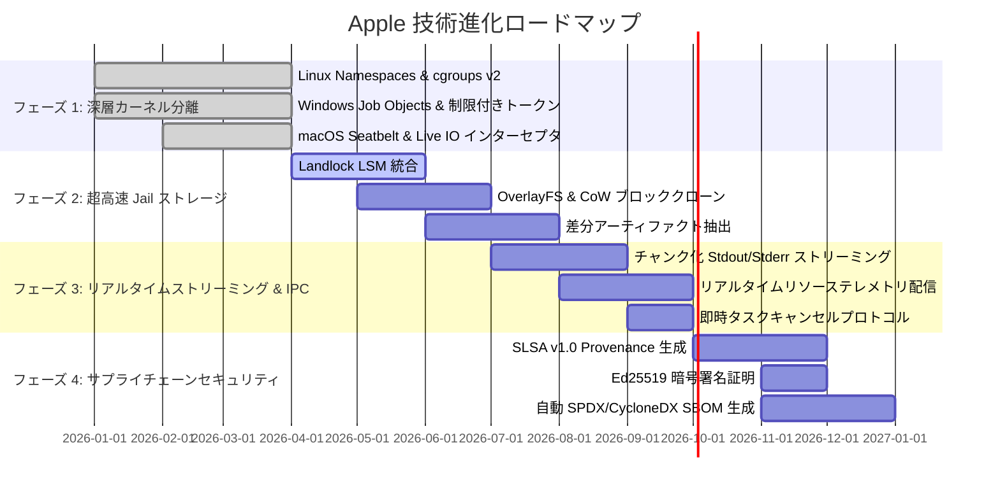

# 🗺️ Apple 技術ロードマップ (ROADMAP): 密閉サンドボックス＆プロセス分離アーキテクチャ

> 🌐 **Language Navigation / 多语言文档 / 多語言文檔 / ドキュメント言語:**
> [English](../../ROADMAP.md) | [Tiếng Việt](../vi/ROADMAP.md) | [日本語](ROADMAP.md) | [简体中文](../zh-hans/ROADMAP.md) | [繁體中文](../zh-hant/ROADMAP.md)

---

## 📌 ビジョンとアーキテクチャ戦略

**Apple** は、マルチツールチェーンビルドシステム（[Fish](https://github.com/requla11/fish) と連携）向けに設計された、エンタープライズグレードの密閉サンドボックス、プロセス分離デーモン、および決定論的実行エンジンです。

本ロードマップは、Apple をローカル Jail から、**SLSA Build Level 3** サプライチェーンセキュリティ認証を備えたカーネルレベルの封じ込めエンジンへと進化させるための技術フェーズ、アーキテクチャのマイルストーン、およびスケジュールを策定したものです。

---

## 🛣️ ロードマップ概要

---

## 🎯 各フェーズ詳細

### フェーズ 1: OS 深層カーネル分離＆プロセス封じ込め (完了)
- [x] **Linux カーネル Namespaces**: 非特権コンテナ分離 (`CLONE_NEWNS`, `CLONE_NEWNET`, `CLONE_NEWPID`, `CLONE_NEWIPC`, `CLONE_NEWUTS`, `CLONE_NEWUSER`)。
- [x] **cgroups v2 ハードウェア制御**: RAM 上限 (`memory.max`)、CPU クォータ (`cpu.max`)、コアアフィニティ (`cpuset.cpus`) の厳格な管理。
- [x] **seccomp-bpf システムコールフィルタ**: 不正なシステムコールのブロック（`ptrace`、オフライン時の raw ソケットバインド、カーネルモジュール操作など）。
- [x] **Windows Job Objects ＆ 制限付きトークン**: `QueryInformationJobObject` によるピークメモリ計測、管理者権限の剥奪および Low Integrity レベルへの降格 (`SECURITY_MANDATORY_LOW_RID`)。
- [x] **macOS Darwin Seatbelt 隔離**: SBPL プロファイルジェネレータおよび `clang`、`swiftc`、`rustc` 向け `sandbox-exec` ラッパー。
- [x] **リアルタイム Live I/O ＆ 機密ファイルインターセプタ**: `.env`、`id_rsa`、AWS 認証情報、未宣言 DAG ヘッダーへのアクセス監視。

---

### フェーズ 2: 超高速 Jail ストレージ＆ゼロコピー・スナップショット (2026 Q2-Q3)
- [ ] **Linux Landlock LSM 統合**:
  - Linux 5.13+ カーネルレベルでの非特権ファイルシステムアクセス制御。
  - root 権限不要で各タスク専用ディレクトリへの詳細なアクセス許可。
- [ ] **Copy-on-Write (CoW) ＆ 即時ブロッククローン**:
  - OverlayFS (Linux)、APFS `clonefile` (macOS)、ReFS ブロッククローン (Windows) の統合。
  - 10 万ファイル規模のリポジトリにおける Jail 作成時間を ~50ms から **< 1ms** に短縮。
- [ ] **差分アーティファクト同期 (Differential Artifact Sync)**:
  - 新規生成されたビルド成果物（`target/`, `.o`, `dist/`）を自動検出し、ワークスペースへ同期。
  - コンパイラの中間一時ファイルを自動破棄し、ソースツリーを完全にクリーンに維持。

---

### フェーズ 3: リアルタイム・ストリーミング IPC ＆ テレメトリ配信 (2026 Q3)
- [ ] **チャンク化出力ストリーミング**:
  - Unix ドメインソケットおよび Windows Named Pipe を介したリアルタイム stdout/stderr チャンク配信。
  - 長時間のコンパイルタスクにおける IPC バッファオーバーフローを防止。
- [ ] **リアルタイムテレメトリ ＆ ダッシュボード統合**:
  - CPU 使用率、ピーク RSS メモリ、I/O 速度を Fish Web Dashboard および Ratatui TUI へ直接配信。
- [ ] **即時タスクキャンセルプロトコル**:
  - `DaemonMessage::Cancel { task_id }` によるプロセスグループ即時終了 (`SIGKILL`) と Windows Job Object 破棄。

---

### フェーズ 4: エンタープライズ・サプライチェーンセキュリティ ＆ SLSA v1.0 (2026 Q4)
- [ ] **SLSA Build Level 3 Provenance 生成**:
  - 改ざん防止 in-toto / SLSA v1.0 provenance JSON メタデータを生成。
  - 入力ハッシュ、コンパイラ引数、密閉環境スナップショット、成果物の BLAKE3 ハッシュを記録。
- [ ] **暗号署名 (Ed25519 & Cosign)**:
  - ローカル Ed25519 鍵ペアまたはハードウェアトークンを用いた検証レポートのデジタル署名。
  - 改ざん防止保証の提供。
- [ ] **自動 SBOM 生成**:
  - ビルド監査ログにリンクした標準 SPDX および CycloneDX ソフトウェア部品表を出力。

---

### フェーズ 5: 分散サンドボックス ＆ Micro-VM 封じ込め (2027+)
- [ ] **Micro-VM フォールバックエンジン**:
  - 信頼できないビルドスクリプトや外部プラグインを軽量 Micro-VM (Firecracker / Cloud-Hypervisor) で実行。
- [ ] **分散リモートワーカーサンドボックス**:
  - リモートビルドファーム全体で密閉サンドボックス環境を同期するネイティブ gRPC プロトコル。

---

## 📈 品質・検証不変条件

1. **スタブコードの排除 (Zero Fake Stubs)**: 全ての機能は本物の OS 分離を提供するか、型付きエラーを返却。
2. **コード内コメントの排除 (Zero Code Comments)**: 明確で自己文書化されたコードベースの維持。
3. **完全なクロスプラットフォーム互換性**: Linux、Windows、macOS で同等の機能を提供。
4. **100% CI ゲート**: 全 Pull Request は全 OS の Matrix テストを完全に通過することを義務付け。
