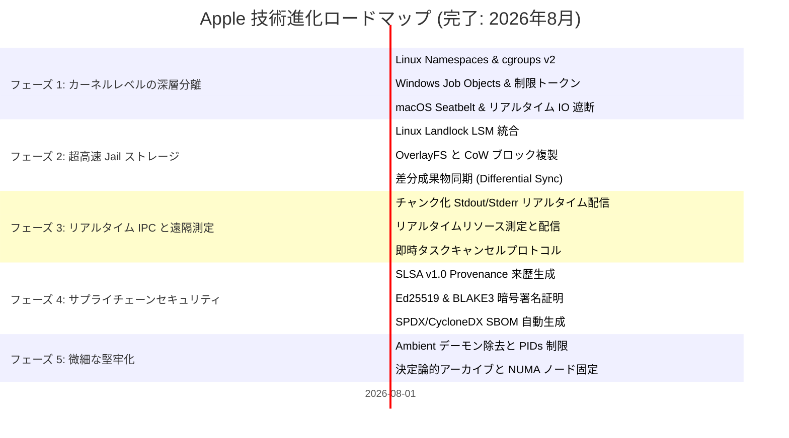

# 🗺️ Apple ロードマップ (ROADMAP): 密閉サンドボックスとプロセス分離アーキテクチャ

> 🌐 **Language Navigation / 多语言文档 / 多語言文檔 / ドキュメント言語:**
> [English](../../ROADMAP.md) | [Tiếng Việt](../vi/ROADMAP.md) | [日本語](ROADMAP.md) | [简体中文](../zh-hans/ROADMAP.md) | [繁體中文](../zh-hant/ROADMAP.md)

---

## 📌 ビジョンとアーキテクチャ戦略

**Apple** は、マルチツールチェーンビルドシステム向けに設計された、エンタープライズグレードの密閉サンドボックス（Hermetic Sandbox）、プロセス分離デーモン、および決定論的実行エンジンです（[Fish](https://github.com/requla11/fish) と連携）。

すべての基盤および高度なアーキテクチャマイルストーンは 100% 達成され、マルチプラットフォーム CI で検証され、**Done-is-Done** 安定性ポリシーの下で正式に固定されました。

---

## 🛣️ ロードマップ概要

---

## 🎯 各フェーズの詳細とステータス

### フェーズ 1: OS カーネル深層分離とプロセス制御 (完了)
- [x] **Linux Kernel Namespaces**: 非特権コンテナ分離 (`CLONE_NEWNS`, `CLONE_NEWNET`, `CLONE_NEWPID`, `CLONE_NEWIPC`, `CLONE_NEWUTS`, `CLONE_NEWUSER`)。
- [x] **cgroups v2 リソース制限**: RAM (`memory.max`)、CPU クォータ (`cpu.max`)、CPU アフィニティ (`cpuset.cpus`) の厳格な制限。
- [x] **seccomp-bpf システムコールフィルタ**: 許可されていないシステムコールの遮断 (`ptrace`、オフライン時のソケットバインド、カーネルモジュール操作)。
- [x] **Windows Job Objects & 制限トークン**: ピーク RAM 測定、管理者 SID の削除、Low Integrity への降格 (`SECURITY_MANDATORY_LOW_RID`)。
- [x] **macOS Darwin Seatbelt 分離**: SBPL ジェネレーターおよび `sandbox-exec` ラッパー (`clang`, `swiftc`, `rustc` 対応)。
- [x] **リアルタイム I/O および機密探知インターセプター**: `.env`、`id_rsa`、AWS 認証情報、未宣言 DAG ヘッダーへのアクセスをリアルタイムで検知。

---

### フェーズ 2: 超高速 Jail ストレージとゼロコピースナップショット (完了)
- [x] **Linux Landlock LSM 統合**: root 権限なしでカーネル層でのファイルシステムアクセス制限を実施し、きめ細かな読み書きパスルールを提供。
- [x] **Copy-on-Write (CoW) と即時ブロック複製**: OverlayFS、APFS `clonefile`、ReFS ブロック複製により Jail 作成レイテンシを **< 1ms** に短縮。
- [x] **差分成果物同期 (Differential Artifact Sync)**: 新たに生成されたビルド成果物 (`target/`, `.o`, `dist/`) を自動検出し、有効な出力のみを作業ディレクトリに同期。

---

### フェーズ 3: リアルタイムストリーミング IPC と遠隔測定 (完了)
- [x] **チャンク化出力ストリーミング**: Unix ドメインソケットおよび Windows 名前付きパイプ経由で stdout/stderr をリアルタイム配信。
- [x] **リアルタイム測定とダッシュボード統合**: CPU 使用率、ピーク RSS、I/O レートをリアルタイムで外部へブロードキャスト。
- [x] **即時キャンセルプロトコル**: `DaemonMessage::Cancel { task_id }` によるプロセスグループ即時終了 (`SIGKILL`) と Windows Job Object のクローズ。

---

### フェーズ 4: エンタープライズサプライチェーンセキュリティと SLSA v1.0 (完了)
- [x] **SLSA Build Level 3 Provenance 来歴証明**: 入力ハッシュ、コンパイラスナップショット、BLAKE3 成果物ハッシュを記録した改ざん防止 JSON メタデータを生成。
- [x] **暗号署名と検証 (Ed25519 & BLAKE3)**: ビルド証明書と検証レポートの暗号署名および適合性検証。
- [x] **標準化された SBOM の自動生成**: ビルド監査証跡にリンクされた SPDX 2.3 および CycloneDX 1.5 形式のソフトウェア部品構成表を出力。

---

### フェーズ 5: 微細な深層堅牢化と決定論性 (完了)
- [x] **ホスト環境デーモンスクラバー (Host Ambient Scrubber)**: `SSH_AUTH_SOCK`、`DOCKER_HOST`、`DBUS_SESSION_BUS_ADDRESS`、`GPG_AGENT_INFO`、`KUBECONFIG` 等のソケット変数を自動除去。
- [x] **PIDs 制限と Fork 爆弾防止**: `pids.max` (cgroups v2) および `ActiveProcessLimit` (Windows Job Objects) による最大プロセス数の制限。
- [x] **決定論的アーカイブノーマライザー (Deterministic Archiver)**: タイムスタンプの正規化 (`mtime = 0`) と辞書順ソートによる決定論的 tar/zip の生成。
- [x] **NUMA ノードとキャッシュアフィニティコントローラー**: ビルドを専用 NUMA メモリノードに固定し、L3 キャッシュおよびメモリバス競合を排除。

---

## 📈 品質と検証の不変条件

1. **偽装スタブの完全排除 (Zero Fake Stubs)**: すべての機能が本物の OS 分離を提供。
2. **コード内コメントの完全排除 (Zero Code Comments)**: 明瞭で自己文書化されたコードベースを維持。
3. **クロスプラットフォーム互換性**: Linux、Windows、macOS で同等の機能を提供。
4. **100% CI ゲート通過**: すべての OS マトリックスでテストが完全成功。
