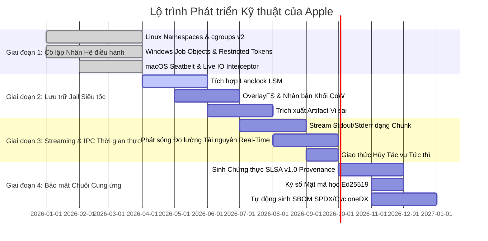

# 🗺️ Lộ Trình Phát Triển Apple (ROADMAP): Hộp Cát Hermetic & Kiến Trúc Cô Lập Tiến Trình

> 🌐 **Language Navigation / 多语言文档 / 多語言文檔 / ドキュメント言語:**
> [English](../../ROADMAP.md) | [Tiếng Việt](ROADMAP.md) | [日本語](../ja/ROADMAP.md) | [简体中文](../zh-hans/ROADMAP.md) | [繁體中文](../zh-hant/ROADMAP.md)

---

## 📌 Tầm nhìn & Chiến lược Kiến trúc

**Apple** là hệ thống daemon cô lập tiến trình, hộp cát khép kín (hermetic sandbox) cấp doanh nghiệp và bộ máy thực thi xác định (deterministic execution engine) được thiết kế cho các hệ thống build đa công cụ (kết hợp cùng [Fish](https://github.com/requla11/fish)).

Lộ trình này vạch rõ các giai đoạn kỹ thuật, cột mốc kiến trúc và mốc thời gian hoàn thiện để đưa Apple từ một hộp cát cục bộ thành bộ máy cô lập tầng sâu cấp kernel với chứng thực chuỗi cung ứng bảo mật đạt chuẩn **SLSA Build Level 3**.

---

## 🛣️ Tổng quan Lộ trình

---

## 🎯 Chi tiết từng Giai đoạn

### Giai đoạn 1: Cô lập Tầng sâu Kernel & Ngăn chặn Tiến trình (Đã hoàn thành)
- [x] **Linux Kernel Namespaces**: Cô lập container không đặc quyền (`CLONE_NEWNS`, `CLONE_NEWNET`, `CLONE_NEWPID`, `CLONE_NEWIPC`, `CLONE_NEWUTS`, `CLONE_NEWUSER`).
- [x] **Kiểm soát cgroups v2**: Khống chế hạn ngạch phần cứng tuyệt đối cho RAM (`memory.max`), quota CPU (`cpu.max`), và core affinity (`cpuset.cpus`).
- [x] **Lọc Syscall seccomp-bpf**: Chặn các lời gọi hệ thống nguy hiểm (`ptrace`, bind socket khi offline, nạp module nhân).
- [x] **Windows Job Objects & Restricted Tokens**: Đo lường RAM đỉnh qua `QueryInformationJobObject`, tước quyền admin và hạ cấp token xuống Low Integrity (`SECURITY_MANDATORY_LOW_RID`).
- [x] **macOS Darwin Seatbelt**: Sinh hồ sơ SBPL và bọc lệnh `sandbox-exec` cho `clang`, `swiftc`, `rustc`.
- [x] **Bộ đón chặn Live I/O & Rò rỉ Bí mật**: Phát hiện thời gian thực các hành vi đọc trộm `.env`, `id_rsa`, AWS credentials và header chưa khai báo trong DAG.

---

### Giai đoạn 2: Lưu trữ Jail Siêu tốc & Ảnh chụp CoW Không Sao Chép (Q2-Q3 2026)
- [ ] **Tích hợp Linux Landlock LSM**:
  - Hạn chế quyền truy cập filesystem trực tiếp ở cấp độ nhân Linux (Kernel 5.13+) không cần quyền root.
  - Cấp quyền đọc/ghi chi tiết cho từng thư mục cụ thể của tác vụ build.
- [ ] **Copy-on-Write (CoW) & Nhân bản Khối Tức thì**:
  - Tích hợp OverlayFS (Linux), APFS `clonefile` (macOS), và ReFS Block Cloning (Windows).
  - Giảm độ trễ tạo Jail từ ~50ms xuống **< 1ms** cho kho mã nguồn chứa hơn 100.000 files.
- [ ] **Đồng bộ hóa Artifact Vi sai (Differential Artifact Sync)**:
  - Tự động nhận diện các sản phẩm build mới (`target/`, `.o`, `dist/`) và chỉ đồng bộ đúng output về workspace.
  - Tự động dọn sạch rác trung gian của compiler, giữ source tree nguyên bản 100%.

---

### Giai đoạn 3: Streaming IPC Thời gian thực & Phát sóng Đo lường (Q3 2026)
- [ ] **Stream Output theo từng Chunk**:
  - Truyền phát dữ liệu stdout và stderr thời gian thực qua Unix Domain Socket và Windows Named Pipe.
  - Loại bỏ hoàn toàn hiện tượng tràn bộ đệm IPC đối với các tác vụ biên dịch dài.
- [ ] **Phát sóng Đo lường & Tích hợp Dashboard**:
  - Phát sóng trực tiếp biểu đồ % CPU, RAM RSS đỉnh, và tốc độ I/O về Fish Web Dashboard và Ratatui TUI.
- [ ] **Giao thức Hủy Tác vụ Tức thì**:
  - Hỗ trợ bản tin `DaemonMessage::Cancel { task_id }` với cơ chế ngắt tức thì tiến trình (`SIGKILL` process group) và đóng Windows Job Object.

---

### Giai đoạn 4: Bảo mật Chuỗi Cung ứng & SLSA v1.0 (Q4 2026)
- [ ] **Chứng thực Nguồn gốc SLSA Build Level 3**:
  - Sinh siêu dữ liệu JSON in-toto / SLSA v1.0 chống giả mạo.
  - Ghi nhận đầy đủ hash đầu vào, cờ compiler, snapshot môi trường hermetic và hash BLAKE3 của artifact.
- [ ] **Ký số Mật mã học (Ed25519 & Cosign)**:
  - Ký số báo cáo xác minh và chứng thực bản build bằng khóa Ed25519 hoặc token phần cứng.
- [ ] **Tự động sinh SBOM Chuẩn hóa**:
  - Xuất danh mục thành phần phần mềm chuẩn SPDX và CycloneDX gắn liền với nhật ký kiểm toán build.

---

### Giai đoạn 5: Sandbox Phân tán & Đóng gói Micro-VM (2027+)
- [ ] **Bộ máy Dự phòng Micro-VM**:
  - Tùy chọn chạy build script hoặc compiler plugin của bên thứ ba trong micro-VM (Firecracker / Cloud-Hypervisor).
- [ ] **Sandbox Máy chủ Build Phân tán**:
  - Giao thức gRPC đồng bộ môi trường sandbox hermetic trên toàn mạng lưới build farm từ xa.

---

## 📈 Nguyên tắc Bất biến về Chất lượng

1. **Không Dùng Mã Giả (Zero Fake Stubs)**: Mọi tính năng phải cung cấp khả năng cô lập thực sự từ hệ điều hành hoặc trả về lỗi có cấu trúc.
2. **Không Viết Comment Vào Code**: Giữ mã nguồn ngắn gọn, tường minh, tự giải thích.
3. **Tương thích Đa nền tảng**: Đảm bảo tính năng đồng đều trên Linux, Windows và macOS.
4. **100% Vượt qua CI Matrix**: Mọi thay đổi bắt buộc phải vượt qua toàn bộ bài kiểm thử trên tất cả các hệ điều hành.
