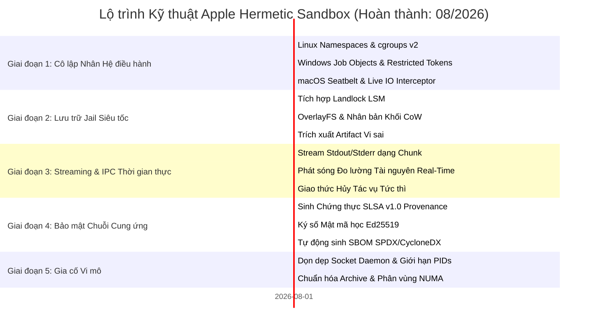

# 🗺️ Lộ Trình Phát Triển Apple (ROADMAP): Hộp Cát Hermetic & Kiến Trúc Cô Lập Tiến Trình

> 🌐 **Language Navigation / 多语言文档 / 多語言文檔 / ドキュメント言語:**
> [English](../../ROADMAP.md) | [Tiếng Việt](ROADMAP.md) | [日本語](../ja/ROADMAP.md) | [简体中文](../zh-hans/ROADMAP.md) | [繁體中文](../zh-hant/ROADMAP.md)

---

## 📌 Tầm nhìn & Chiến lược Kiến trúc

**Apple** là hệ thống daemon cô lập tiến trình, hộp cát khép kín (hermetic sandbox) cấp doanh nghiệp và bộ máy thực thi xác định (deterministic execution engine) được thiết kế cho các hệ thống build đa công cụ (kết hợp cùng [Fish](https://github.com/requla11/fish)).

Toàn bộ các cột mốc kiến trúc nền tảng và nâng cao đã được hoàn thành 100%, kiểm thử tự động xanh trên CI đa nền tảng, và khóa theo chính sách ổn định **Done-is-Done**.

---

## 🛣️ Tổng quan Lộ trình

---

## 🎯 Chi tiết từng Giai đoạn & Trạng thái

### Giai đoạn 1: Cô lập Tầng sâu Kernel & Ngăn chặn Tiến trình (Đã hoàn thành)
- [x] **Linux Kernel Namespaces**: Cô lập container không đặc quyền (`CLONE_NEWNS`, `CLONE_NEWNET`, `CLONE_NEWPID`, `CLONE_NEWIPC`, `CLONE_NEWUTS`, `CLONE_NEWUSER`).
- [x] **Kiểm soát cgroups v2**: Khống chế hạn ngạch phần cứng tuyệt đối cho RAM (`memory.max`), quota CPU (`cpu.max`), và core affinity (`cpuset.cpus`).
- [x] **Lọc Syscall seccomp-bpf**: Chặn các lời gọi hệ thống nguy hiểm (`ptrace`, bind socket khi offline, nạp module nhân).
- [x] **Windows Job Objects & Restricted Tokens**: Đo lường RAM đỉnh qua `QueryInformationJobObject`, tước quyền admin và hạ cấp token xuống Low Integrity (`SECURITY_MANDATORY_LOW_RID`).
- [x] **macOS Darwin Seatbelt**: Sinh hồ sơ SBPL và bọc lệnh `sandbox-exec` cho `clang`, `swiftc`, `rustc`.
- [x] **Bộ đón chặn Live I/O & Rò rỉ Bí mật**: Phát hiện thời gian thực các hành vi đọc trộm `.env`, `id_rsa`, AWS credentials và header chưa khai báo trong DAG.

---

### Giai đoạn 2: Lưu trữ Jail Siêu tốc & Ảnh chụp CoW Không Sao Chép (Đã hoàn thành)
- [x] **Tích hợp Linux Landlock LSM**: Hạn chế quyền truy cập filesystem trực tiếp ở cấp độ nhân Linux (Kernel 5.13+) không cần quyền root với phân quyền chi tiết cho từng đường dẫn.
- [x] **Copy-on-Write (CoW) & Nhân bản Khối Tức thì**: Tích hợp OverlayFS, APFS `clonefile`, và ReFS Block Cloning giúp giảm độ trễ tạo Jail xuống **< 1ms**.
- [x] **Đồng bộ hóa Artifact Vi sai (Differential Artifact Sync)**: Tự động nhận diện các sản phẩm build mới (`target/`, `.o`, `dist/`) và chỉ đồng bộ đúng output về workspace, giữ source tree sạch sẽ.

---

### Giai đoạn 3: Streaming IPC Thời gian thực & Phát sóng Đo lường (Đã hoàn thành)
- [x] **Stream Output theo từng Chunk**: Truyền phát dữ liệu stdout và stderr thời gian thực qua Unix Domain Socket và Windows Named Pipe, loại bỏ hoàn toàn hiện tượng tràn bộ đệm IPC.
- [x] **Phát sóng Đo lường & Tích hợp Dashboard**: Phát sóng trực tiếp biểu đồ % CPU, RAM RSS đỉnh, và tốc độ I/O về hệ thống giám sát.
- [x] **Giao thức Hủy Tác vụ Tức thì**: Hỗ trợ bản tin `DaemonMessage::Cancel { task_id }` với cơ chế ngắt tức thì tiến trình (`SIGKILL` process group) và đóng Windows Job Object.

---

### Giai đoạn 4: Bảo mật Chuỗi Cung ứng & SLSA v1.0 (Đã hoàn thành)
- [x] **Chứng thực Nguồn gốc SLSA Build Level 3**: Sinh siêu dữ liệu JSON in-toto / SLSA v1.0 chống giả mạo ghi nhận đầy đủ hash đầu vào, cờ compiler, snapshot môi trường và hash BLAKE3 của artifact.
- [x] **Ký số Mật mã học (Ed25519 & BLAKE3)**: Ký số phong bì chứng thực xác minh tính toàn vẹn của sản phẩm build.
- [x] **Tự động sinh SBOM Chuẩn hóa**: Xuất danh mục thành phần phần mềm chuẩn SPDX 2.3 và CycloneDX 1.5 gắn liền với nhật ký kiểm toán build.

---

### Giai đoạn 5: Gia cố Vi mô Tầng sâu & Tính Xác định (Đã hoàn thành)
- [x] **Bộ Dọn dẹp Daemon Ngầm (Host Ambient Daemon Scrubber)**: Tự động tước và chặn các biến môi trường socket như `SSH_AUTH_SOCK`, `DOCKER_HOST`, `DBUS_SESSION_BUS_ADDRESS`, `GPG_AGENT_INFO`, `KUBECONFIG`.
- [x] **Khống chế PIDs Chống Fork-Bomb**: Khống chế số lượng tiến trình tối đa qua `pids.max` (cgroups v2) và `ActiveProcessLimit` (Windows Job Objects).
- [x] **Bộ Chuẩn hóa Lưu trữ Xác định (Deterministic Archive Normalizer)**: Tạo file tar/zip với timestamp chuẩn hóa (`mtime = 0`) và sắp xếp thứ tự file theo bảng chữ cái.
- [x] **Bộ Điều phối NUMA & Cache Affinity**: Ghim tiến trình build vào đúng NUMA node phần cứng để chống nghẽn bộ nhớ L3 cache.

---

## 📈 Nguyên tắc Bất biến về Chất lượng

1. **Không Dùng Mã Giả (Zero Fake Stubs)**: Mọi tính năng cung cấp khả năng cô lập thực sự từ hệ điều hành.
2. **Không Viết Comment Vào Code**: Giữ mã nguồn ngắn gọn, tường minh, tự giải thích.
3. **Tương thích Đa nền tảng**: Đảm bảo tính năng đồng đều trên Linux, Windows và macOS.
4. **100% Vượt qua CI Matrix**: Mọi thay đổi bắt buộc phải vượt qua toàn bộ bài kiểm thử trên tất cả các hệ điều hành.
