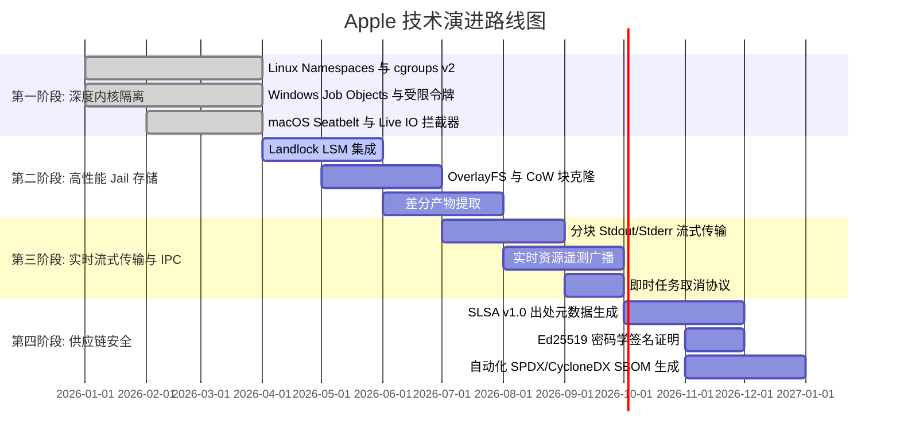

# 🗺️ Apple 技术路线图 (ROADMAP): 密闭沙箱与进程隔离架构

> 🌐 **Language Navigation / 多语言文档 / 多語言文檔 / ドキュメント言語:**
> [English](../../ROADMAP.md) | [Tiếng Việt](../vi/ROADMAP.md) | [日本語](../ja/ROADMAP.md) | [简体中文](ROADMAP.md) | [繁體中文](../zh-hant/ROADMAP.md)

---

## 📌 愿景与架构战略

**Apple** 是为多工具链构建系统量身定制的企业级密闭沙箱、进程隔离守护进程与确定性执行引擎（与 [Fish](https://github.com/requla11/fish) 协同工作）。

本路线图规划了技术阶段、架构里程碑和交付时间线，致力于将 Apple 从本地 Jail 演进为通过 **SLSA Build Level 3** 供应链安全认证的内核级隔离引擎。

---

## 🛣️ 路线图概览

---

## 🎯 各阶段详细规划

### 第一阶段: 操作系统深度内核隔离与进程遏制 (已完成)
- [x] **Linux 内核命名空间**: 非特权容器隔离 (`CLONE_NEWNS`, `CLONE_NEWNET`, `CLONE_NEWPID`, `CLONE_NEWIPC`, `CLONE_NEWUTS`, `CLONE_NEWUSER`)。
- [x] **cgroups v2 硬件配额**: 严格控制内存上限 (`memory.max`)、CPU 配额 (`cpu.max`) 和核心亲和性 (`cpuset.cpus`)。
- [x] **seccomp-bpf 系统调用过滤**: 拦截非法系统调用（`ptrace`、离线状态下的原始套接字绑定、内核模块加载等）。
- [x] **Windows Job Objects 与受限令牌**: 统计峰值内存占用 (`QueryInformationJobObject`)、剥离管理员特权并降级至低完整性级别 (`SECURITY_MANDATORY_LOW_RID`)。
- [x] **macOS Darwin Seatbelt 隔离**: SBPL 沙箱配置生成器及针对 `clang`、`swiftc`、`rustc` 的 `sandbox-exec` 包装。
- [x] **实时 Live I/O 与机密探测拦截器**: 实时监控对 `.env`、`id_rsa`、AWS 凭证以及未在 DAG 中声明的头文件的探测。

---

### 第二阶段: 极速 Jail 存储与零拷贝快照 (2026 Q2-Q3)
- [ ] **Linux Landlock LSM 集成**:
  - 在 Linux 5.13+ 内核层面实现非特权文件系统访问权限控制。
  - 精准授予各构建任务目录的读写权限，无需 root 权限。
- [ ] **写时复制 (CoW) 与即时块克隆**:
  - 集成 OverlayFS (Linux)、APFS `clonefile` (macOS) 和 ReFS 块克隆 (Windows)。
  - 在包含十万级文件的代码库中将 Jail 创建耗时从 ~50ms 降低至 **< 1ms**。
- [ ] **差分构建产物同步 (Differential Artifact Sync)**:
  - 自动识别新生成的构建产物（`target/`, `.o`, `dist/`）并同步回工作区。
  - 自动丢弃编译器中间临时文件，保持源码目录绝对干净。

---

### 第三阶段: 实时流式 IPC 与遥测广播 (2026 Q3)
- [ ] **分块输出流式传输**:
  - 通过 Unix Domain Socket 和 Windows Named Pipe 实时传输 stdout/stderr 数据块。
  - 彻底消除长时间编译任务导致的 IPC 缓冲区溢出。
- [ ] **实时遥测与仪表盘集成**:
  - 将 CPU 利用率、峰值 RSS 内存及 I/O 速率实时广播至 Fish Web Dashboard 和 Ratatui TUI。
- [ ] **即时任务取消协议**:
  - 支持 `DaemonMessage::Cancel { task_id }` 消息，立即终止进程组 (`SIGKILL`) 并关闭 Windows Job Object。

---

### 第四阶段: 企业级供应链安全与 SLSA v1.0 (2026 Q4)
- [ ] **SLSA Build Level 3 构建出处证明**:
  - 生成防篡改的 in-toto / SLSA v1.0 provenance JSON 元数据。
  - 完整记录输入哈希、编译器参数、密闭环境快照以及产物的 BLAKE3 哈希。
- [ ] **密码学签名 (Ed25519 & Cosign)**:
  - 使用本地 Ed25519 密钥对或硬件令牌对构建报告和产物证明进行数字签名。
- [ ] **自动化 SBOM 生成**:
  - 导出与构建审计日志紧密关联的标准 SPDX 和 CycloneDX 软件物料清单。

---

### 第五阶段: 分布式沙箱与 Micro-VM 容器化 (2027+)
- [ ] **Micro-VM 备用隔离引擎**:
  - 可选在轻量级 Micro-VM (Firecracker / Cloud-Hypervisor) 中执行不受信任的构建脚本与第三方插件。
- [ ] **分布式远程构建沙箱**:
  - 原生 gRPC 执行协议，跨远程构建农场保持密闭执行环境一致性。

---

## 📈 质量与验证不变性

1. **零虚假桩代码 (Zero Fake Stubs)**: 每项功能均提供真实 OS 隔离或返回类型化错误。
2. **代码无注释 (Zero Code Comments)**: 代码结构清晰、自说明。
3. **跨平台全兼容**: Linux、Windows、macOS 功能对等。
4. **100% CI 通过门禁**: 所有 Pull Request 必须在所有平台 Matrix 测试中全部通过。
