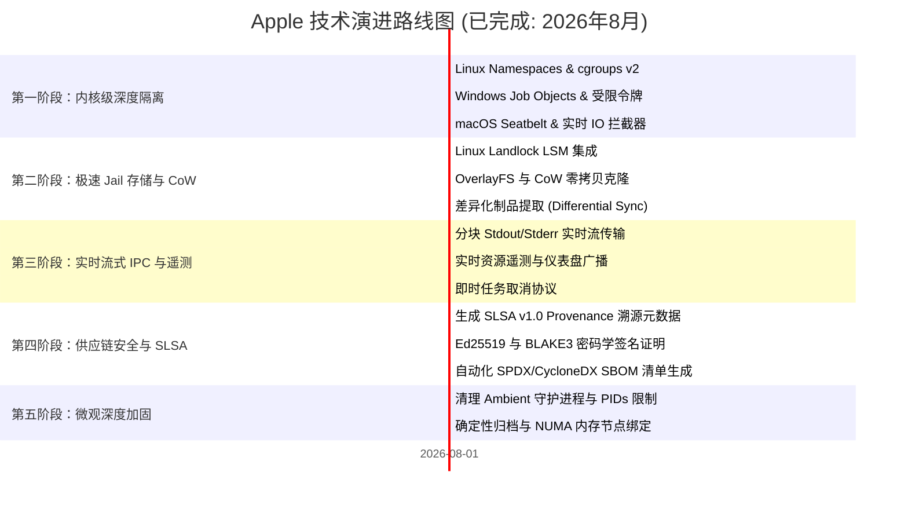

# 🗺️ Apple 路线图 (ROADMAP): 密闭沙箱与进程隔离架构

> 🌐 **Language Navigation / 多语言文档 / 多語言文檔 / ドキュメント言語:**
> [English](../../ROADMAP.md) | [Tiếng Việt](../vi/ROADMAP.md) | [日本語](../ja/ROADMAP.md) | [简体中文](ROADMAP.md) | [繁體中文](../zh-hant/ROADMAP.md)

---

## 📌 愿景与架构战略

**Apple** 是专为多工具链构建系统设计的企业级密闭沙箱 (Hermetic Sandbox)、进程隔离守护进程和确定性执行引擎（与 [Fish](https://github.com/requla11/fish) 协同工作）。

所有基础和高级架构里程碑均已 100% 圆满完成，并通过了多平台自动化 CI 验证，正式遵循 **Done-is-Done** 冻结与稳定策略。

---

## 🛣️ 路线图概览

---

## 🎯 各阶段详细内容与状态

### 第一阶段：OS 内核深度隔离与进程约束 (已完成)
- [x] **Linux Kernel Namespaces**: 非特权容器隔离 (`CLONE_NEWNS`, `CLONE_NEWNET`, `CLONE_NEWPID`, `CLONE_NEWIPC`, `CLONE_NEWUTS`, `CLONE_NEWUSER`)。
- [x] **cgroups v2 硬件限额**: 严格控制 RAM (`memory.max`)、CPU 配额 (`cpu.max`) 和 CPU 核心亲和性 (`cpuset.cpus`)。
- [x] **seccomp-bpf 系统调用过滤**: 拦截非法系统调用 (`ptrace`、离线时绑定网络套接字、加载内核模块)。
- [x] **Windows Job Objects & 受限令牌**: 测量峰值 RAM，剥离管理员 SID 并降级为 Low Integrity 级别 (`SECURITY_MANDATORY_LOW_RID`)。
- [x] **macOS Darwin Seatbelt 隔离**: SBPL 策略生成器和 `sandbox-exec` 包装器（支持 `clang`、`swiftc`、`rustc`）。
- [x] **实时 I/O 与凭据探针拦截器**: 实时捕获未声明访问 `.env`、`id_rsa`、AWS 凭证以及 DAG 未声明头文件的行为。

---

### 第二阶段：极速 Jail 存储与零拷贝快照 (已完成)
- [x] **Linux Landlock LSM 集成**: 无需 root 权限在内核层控制文件系统访问权限，提供细粒度的路径读写规则。
- [x] **写时复制 (CoW) 与即时块克隆**: 集成 OverlayFS、APFS `clonefile` 和 ReFS 块克隆，将 Jail 创建延迟降至 **< 1ms**。
- [x] **差异化制品提取 (Differential Artifact Sync)**: 自动检测新生成的构建产物 (`target/`, `.o`, `dist/`) 并仅同步有效输出，保持工作区干净。

---

### 第三阶段：实时流式 IPC 与遥测广播 (已完成)
- [x] **分块输出流传输 (Chunked Streaming)**: 通过 Unix 域套接字和 Windows 命名管道实时传输 stdout/stderr，杜绝缓冲区膨胀。
- [x] **实时遥测与仪表盘广播**: 实时广播 CPU 利用率、峰值 RSS 和 I/O 速率指标。
- [x] **即时取消协议 (Instant Cancellation)**: 支持 `DaemonMessage::Cancel { task_id }`，立即终止进程组 (`SIGKILL`) 并关闭 Windows Job Object。

---

### 第四阶段：企业级供应链安全与 SLSA v1.0 (已完成)
- [x] **SLSA Build Level 3 溯源证明**: 生成防篡改的 in-toto / SLSA v1.0 JSON 元数据，记录输入哈希、编译器快照与 BLAKE3 制品哈希。
- [x] **密码学签名与验证 (Ed25519 & BLAKE3)**: 对构建凭证与验证报告进行密码学信封签名与合规性检查。
- [x] **自动化标准化 SBOM 生成**: 输出与构建审计日志直接关联的 SPDX 2.3 和 CycloneDX 1.5 格式软件物料清单。

---

### 第五阶段：微观深度加固与确定性 (已完成)
- [x] **宿主环境守护进程清理器 (Host Ambient Scrubber)**: 自动剥离并拦截 `SSH_AUTH_SOCK`、`DOCKER_HOST`、`DBUS_SESSION_BUS_ADDRESS`、`GPG_AGENT_INFO`、`KUBECONFIG` 等环境套接字。
- [x] **PIDs 限制与防 Fork 炸弹**: 通过 `pids.max` (cgroups v2) 和 `ActiveProcessLimit` (Windows Job Objects) 限制最大进程数。
- [x] **确定性归档标准化器 (Deterministic Archiver)**: 生成标准时间戳 (`mtime = 0`) 并按字母顺序排序的确定性 tar/zip 文件。
- [x] **NUMA 节点与缓存亲和性控制器**: 将构建绑定至专属 NUMA 内存节点，消除 L3 缓存和内存总线争用。

---

## 📈 质量与验证原则

1. **零伪桩代码 (Zero Fake Stubs)**: 每个功能均提供真实的操作系统隔离支持。
2. **代码零注释 (Zero Code Comments)**: 保持代码库自解释、整洁、精简。
3. **跨平台兼容性**: Linux、Windows 和 macOS 保持完全同等的功能实现。
4. **100% CI 质量门禁**: 所有 Pull Request 必须通过所有操作系统矩阵测试。
