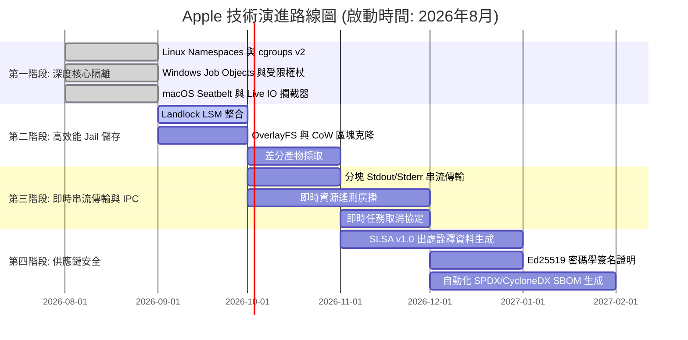

# 🗺️ Apple 技術路線圖 (ROADMAP): 密閉沙箱與進程隔離架構

> 🌐 **Language Navigation / 多语言文档 / 多語言文檔 / ドキュメント言語:**
> [English](../../ROADMAP.md) | [Tiếng Việt](../vi/ROADMAP.md) | [日本語](../ja/ROADMAP.md) | [简体中文](../zh-hans/ROADMAP.md) | [繁體中文](ROADMAP.md)

---

## 📌 願景與架構戰略

**Apple** 是為多工具鏈建置系統量身打造的企業級密閉沙箱、進程隔離守護進程與確定性執行引擎（與 [Fish](https://github.com/requla11/fish) 協同運作）。

本路線圖規劃了技術階段、架構里程碑和交付時程，致力於將 Apple 從本地 Jail 演進為通過 **SLSA Build Level 3** 供應鏈安全認證的內核級隔離引擎。

---

## 🛣️ 路線圖概覽

---

## 🎯 各階段詳細規劃

### 第一階段: 作業系統深度核心隔離與進程遏制 (2026年8月 - 已完成)
- [x] **Linux 核心命名空間**: 非特權容器隔離 (`CLONE_NEWNS`, `CLONE_NEWNET`, `CLONE_NEWPID`, `CLONE_NEWIPC`, `CLONE_NEWUTS`, `CLONE_NEWUSER`)。
- [x] **cgroups v2 硬體配額**: 嚴格控制記憶體上限 (`memory.max`)、CPU 配額 (`cpu.max`) 和核心親和性 (`cpuset.cpus`)。
- [x] **seccomp-bpf 系統呼叫過濾**: 攔截非法系統呼叫（`ptrace`、離線狀態下的原始通訊端綁定、核心模組載入等）。
- [x] **Windows Job Objects 與受限權杖**: 統計峰值記憶體佔用 (`QueryInformationJobObject`)、剝離管理員特權並降級至低完整性級別 (`SECURITY_MANDATORY_LOW_RID`)。
- [x] **macOS Darwin Seatbelt 隔離**: SBPL 沙箱設定生成器及針對 `clang`、`swiftc`、`rustc` 的 `sandbox-exec` 包裝。
- [x] **即時 Live I/O 與機密探測攔截器**: 即時監控對 `.env`、`id_rsa`、AWS 憑證以及未在 DAG 中宣告的標頭檔的探測。

---

### 第二階段: 極速 Jail 儲存與零拷貝快照 (2026年9月 - 10月)

- [ ] **Linux Landlock LSM 整合**:
  - 在 Linux 5.13+ 核心層面實現非特權檔案系統存取權限控制。
  - 精準授予各建置任務目錄的讀寫權限，無需 root 權限。
- [ ] **寫入時複製 (CoW) 與即時區塊克隆**:
  - 整合 OverlayFS (Linux)、APFS `clonefile` (macOS) 和 ReFS 區塊克隆 (Windows)。
  - 在包含十萬級檔案的程式碼庫中將 Jail 建立耗時從 ~50ms 降低至 **< 1ms**。
- [ ] **差分建置產物同步 (Differential Artifact Sync)**:
  - 自動識別新產生的建置產物（`target/`, `.o`, `dist/`）並同步回工作區。
  - 自動丟棄編譯器中間暫存檔案，保持原始碼目錄絕對乾淨。

---

### 第三階段: 即時串流 IPC 與遙測廣播 (2026 Q3)
- [ ] **分塊輸出串流傳輸**:
  - 透過 Unix Domain Socket 和 Windows Named Pipe 即時傳輸 stdout/stderr 資料塊。
  - 徹底消除長時間編譯任務導致的 IPC 緩衝區溢位。
- [ ] **即時遙測與儀表板整合**:
  - 將 CPU 利用率、峰值 RSS 記憶體及 I/O 速率即時廣播至 Fish Web Dashboard 和 Ratatui TUI。
- [ ] **即時任務取消協定**:
  - 支援 `DaemonMessage::Cancel { task_id }` 訊息，立即終止進程組 (`SIGKILL`) 並關閉 Windows Job Object。

---

### 第四階段: 企業級供應鏈安全與 SLSA v1.0 (2026 Q4)
- [ ] **SLSA Build Level 3 建置出處證明**:
  - 生成防篡改的 in-toto / SLSA v1.0 provenance JSON 詮釋資料。
  - 完整記錄輸入雜湊、編譯器參數、密閉環境快照以及產物的 BLAKE3 雜湊。
- [ ] **密碼學簽名 (Ed25519 & Cosign)**:
  - 使用本機 Ed25519 金鑰對或硬體權杖對建置報告和產物證明進行數位簽名。
- [ ] **自動化 SBOM 生成**:
  - 匯出與建置審計記錄緊密關聯的標準 SPDX 和 CycloneDX 軟體物料清單。

---

### 第五階段: 分散式沙箱與 Micro-VM 容器化 (2027+)
- [ ] **Micro-VM 備用隔離引擎**:
  - 可選在輕量級 Micro-VM (Firecracker / Cloud-Hypervisor) 中執行不受信任的建置指令碼與第三方外掛程式。
- [ ] **分散式遠端建置沙箱**:
  - 原生 gRPC 執行協定，跨遠端建置農場保持密閉執行環境一致性。

---

## 📈 品質與驗證不變性

1. **零虛假樁代碼 (Zero Fake Stubs)**: 每項功能均提供真實 OS 隔離或返回型別化錯誤。
2. **程式碼無註釋 (Zero Code Comments)**: 程式碼結構清晰、自說明。
3. **跨平台全相容**: Linux、Windows、macOS 功能對等。
4. **100% CI 通過門禁**: 所有 Pull Request 必須在所有平台 Matrix 測試中全部通過。
