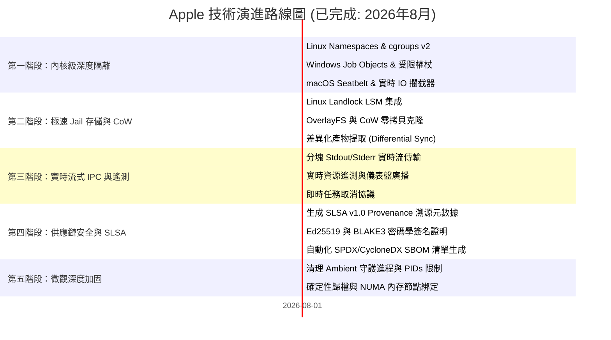

# 🗺️ Apple 路線圖 (ROADMAP): 密閉沙箱與進程隔離架構

> 🌐 **Language Navigation / 多语言文档 / 多語言文檔 / ドキュメント言語:**
> [English](../../ROADMAP.md) | [Tiếng Việt](../vi/ROADMAP.md) | [日本語](../ja/ROADMAP.md) | [简体中文](../zh-hans/ROADMAP.md) | [繁體中文](ROADMAP.md)

---

## 📌 願景與架構戰略

**Apple** 是專為多工具鏈構建系統設計的企業級密閉沙箱 (Hermetic Sandbox)、進程隔離守護進程和確定性執行引擎（與 [Fish](https://github.com/requla11/fish) 協同工作）。

所有基礎和高級架構里程碑均已 100% 圓滿完成，並通過了多平台自動化 CI 驗證，正式遵循 **Done-is-Done** 凍結與穩定策略。

---

## 🛣️ 路線圖概覽

---

## 🎯 各階段詳細內容與狀態

### 第一階段：OS 內核深度隔離與進程約束 (已完成)
- [x] **Linux Kernel Namespaces**: 非特權容器隔離 (`CLONE_NEWNS`, `CLONE_NEWNET`, `CLONE_NEWPID`, `CLONE_NEWIPC`, `CLONE_NEWUTS`, `CLONE_NEWUSER`)。
- [x] **cgroups v2 硬件限額**: 嚴格控制 RAM (`memory.max`)、CPU 配額 (`cpu.max`) 和 CPU 核心親和性 (`cpuset.cpus`)。
- [x] **seccomp-bpf 系統調用過濾**: 攔截非法系統調用 (`ptrace`、離線時綁定網絡套接字、加載內核模塊)。
- [x] **Windows Job Objects & 受限權杖**: 測量峰值 RAM，剝離管理員 SID 並降級為 Low Integrity 級別 (`SECURITY_MANDATORY_LOW_RID`)。
- [x] **macOS Darwin Seatbelt 隔離**: SBPL 策略生成器和 `sandbox-exec` 包裝器（支持 `clang`、`swiftc`、`rustc`）。
- [x] **實時 I/O 與憑據探針攔截器**: 實時捕獲未聲明訪問 `.env`、`id_rsa`、AWS 憑證以及 DAG 未聲明頭文件的行為。

---

### 第二階段：極速 Jail 存儲與零拷貝快照 (已完成)
- [x] **Linux Landlock LSM 集成**: 無需 root 權限在內核層控制文件系統訪問權限，提供細粒度的路徑讀寫規則。
- [x] **寫時複製 (CoW) 與即時塊克隆**: 集成 OverlayFS、APFS `clonefile` 和 ReFS 塊克隆，將 Jail 創建延遲降至 **< 1ms**。
- [x] **差異化產物提取 (Differential Artifact Sync)**: 自動檢測新生成的構建產物 (`target/`, `.o`, `dist/`) 並僅同步有效輸出，保持工作區乾淨。

---

### 第三階段：實時流式 IPC 與遙測廣播 (已完成)
- [x] **分塊輸出流傳輸 (Chunked Streaming)**: 通過 Unix 域套接字和 Windows 命名管道實時傳輸 stdout/stderr，杜絕緩衝區膨脹。
- [x] **實時遙測與儀表盤廣播**: 實時廣播 CPU 利用率、峰值 RSS 和 I/O 速率指標。
- [x] **即時取消協議 (Instant Cancellation)**: 支持 `DaemonMessage::Cancel { task_id }`，立即終止進程組 (`SIGKILL`) 並關閉 Windows Job Object。

---

### 第四階段：企業級供應鏈安全與 SLSA v1.0 (已完成)
- [x] **SLSA Build Level 3 溯源證明**: 生成防篡改的 in-toto / SLSA v1.0 JSON 元數據，記錄輸入哈希、編譯器快照與 BLAKE3 產物哈希。
- [x] **密碼學簽名與驗證 (Ed25519 & BLAKE3)**: 對構建憑證與驗證報告進行密碼學信封簽名與合規性檢查。
- [x] **自動化標準化 SBOM 生成**: 輸出與構建審計日誌直接關聯的 SPDX 2.3 和 CycloneDX 1.5 格式軟件物料清單。

---

### 第五階段：微觀深度加固與確定性 (已完成)
- [x] **宿主環境守護進程清理器 (Host Ambient Scrubber)**: 自動剝離並攔截 `SSH_AUTH_SOCK`、`DOCKER_HOST`、`DBUS_SESSION_BUS_ADDRESS`、`GPG_AGENT_INFO`、`KUBECONFIG` 等環境套接字。
- [x] **PIDs 限制與防 Fork 炸彈**: 通過 `pids.max` (cgroups v2) 和 `ActiveProcessLimit` (Windows Job Objects) 限制最大進程數。
- [x] **確定性歸檔標準化器 (Deterministic Archiver)**: 生成標準時間戳 (`mtime = 0`) 並按字母順序排序的確定性 tar/zip 文件。
- [x] **NUMA 節點與緩存親和性控制器**: 將構建綁定至專屬 NUMA 內存節點，消除 L3 緩存和內存總線爭用。

---

## 📈 質量與驗證原則

1. **零偽樁代碼 (Zero Fake Stubs)**: 每個功能均提供真實的操作系統隔離支持。
2. **代碼零註釋 (Zero Code Comments)**: 保持代碼庫自解釋、整潔、精簡。
3. **跨平台兼容性**: Linux、Windows 和 macOS 保持完全同等的功能實現。
4. **100% CI 質量門禁**: 所有 Pull Request 必須通過所有操作系統矩陣測試。
